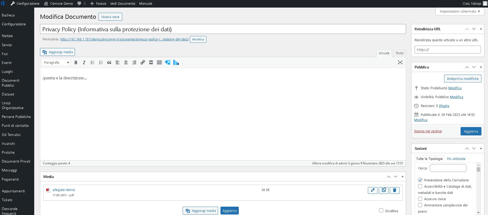
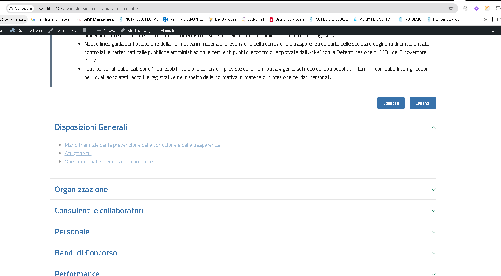

## TODO

### STEP 1

    fai un form con richtexteditor, possibilita' di creare allegati e associare il contenuto/form ad una tipologia/sezione/tassonomia

    sulla falsariga di:

### STEP 2

    possibilita' di pubblicare su wordpress da AlboPretorio
    Albopretorio ha gia la sua UI per la generazione di contenuti, si vuole un pulsante/widget che permetta di pubblicare un contenuto gia' fatto su una sezione

### STEP 3 (LOW PRIORITY)

    ristrutturare/ampliare il plugin, permettendo ad esempio la gestione di nuovi gruppi oltre agli standard:

## CRITICITA'

1. recuperare lista tipologie da endpoint (per creare nuovo contenuto)

2. pubblicare un nuovo contenuto su tipologia di amm. trasparente

3. recuperare albero gruppi / tipologie / contenuti da endpoint (per riprodurre immagine 2 da webapp client)
